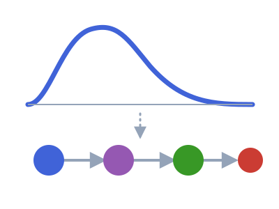

# LoweredDistributions 

<!-- badges:start -->
| **Documentation** | **Build Status** | **Code Quality** | **License & DOI** | **Downloads** |
|:-----------------:|:----------------:|:----------------:|:-----------------:|:-------------:|
| [](https://lowereddistributions.epiaware.org/stable/) [](https://lowereddistributions.epiaware.org/dev/) | [](https://github.com/EpiAware/LoweredDistributions.jl/actions/workflows/test.yaml) [](https://codecov.io/gh/EpiAware/LoweredDistributions.jl) [](https://github.com/EpiAware/LoweredDistributions.jl/actions/workflows/ad.yaml) | [](https://github.com/SciML/SciMLStyle) [](https://github.com/JuliaTesting/Aqua.jl) [](https://github.com/aviatesk/JET.jl) | [](https://opensource.org/licenses/MIT) | [](https://juliapkgstats.com/pkg/LoweredDistributions) [](https://juliapkgstats.com/pkg/LoweredDistributions) |

| ForwardDiff | ReverseDiff (tape) | Enzyme forward | Enzyme reverse | Mooncake reverse | Mooncake forward |
|:---:|:---:|:---:|:---:|:---:|:---:|
| [](https://app.codecov.io/gh/EpiAware/LoweredDistributions.jl?flags%5B0%5D=ad-forwarddiff) | [](https://app.codecov.io/gh/EpiAware/LoweredDistributions.jl?flags%5B0%5D=ad-reversediff) | [](https://app.codecov.io/gh/EpiAware/LoweredDistributions.jl?flags%5B0%5D=ad-enzyme-forward) | [](https://app.codecov.io/gh/EpiAware/LoweredDistributions.jl?flags%5B0%5D=ad-enzyme-reverse) | [](https://app.codecov.io/gh/EpiAware/LoweredDistributions.jl?flags%5B0%5D=ad-mooncake-reverse) | [](https://app.codecov.io/gh/EpiAware/LoweredDistributions.jl?flags%5B0%5D=ad-mooncake-forward) |
<!-- badges:end -->

_A distribution-lowering hub: `lower` maps a `Distributions.Distribution`
onto a backend-agnostic dynamical-systems representation._

## Why LoweredDistributions?

- A delay distribution and a compartmental model are two views of the same
  thing; `lower` gives you the compartmental view without hand-deriving the
  generator each time.
- Exact phase-type matches are used where they exist (Erlang chains,
  two-state CTMCs, Coxian and general phase-type), with moment-matching as a
  documented fallback when no exact chain exists.
- Every lowering converges on one canonical `PhaseType(α, S)` shape, so a new
  backend only has to consume that single interface.
- Four backend extensions (Catalyst, SciMLBase, JumpProcesses,
  AlgebraicPetri) share the same lowering, so switching simulation or
  inference backend does not mean re-deriving the dynamical system.
- A composed chain (ComposedDistributions.jl) or a convolved series
  (ConvolvedDistributions.jl) lowers as a whole, not leaf by leaf, so a
  multi-step delay collapses to one dynamical system too.
- Lowering is exact where the maths allows it and explicit about the rest: a
  shape with no meaningful lowering raises a clear error rather than a silent
  approximation.

See the [lowering tutorial](https://lowereddistributions.epiaware.org/dev/getting-started/tutorials/lowering-backends) for the full hierarchy, the fitting criterion, and a worked example across all four backends.

## Getting started

A `Gamma(3, 1.5)` delay is exactly three exponential compartments in series, each left at rate `1/1.5`, so it lowers to an `ErlangChain`.

```julia
using LoweredDistributions, Distributions

lower(Gamma(3.0, 1.5))
```

Every phase-type lowering converts to the canonical `PhaseType(α, S)` view, the sub-generator shape the backends consume.

```julia
PhaseType(lower(Gamma(3.0, 1.5))).S
```

The [tutorial](https://lowereddistributions.epiaware.org/dev/getting-started/tutorials/lowering-backends) takes one delay through all four backends and checks each against the distribution it came from.
See the [documentation](https://lowereddistributions.epiaware.org/dev/) for the full walkthrough.

## Where to learn more

- Want to get started running code? See the [getting started guide](https://lowereddistributions.epiaware.org/dev/getting-started/).
- Want to understand the API? See the [API reference](https://lowereddistributions.epiaware.org/dev/lib/public).
- Want to see the code? Check out our [GitHub repository](https://github.com/EpiAware/LoweredDistributions.jl).

## Related packages

- [ComposedDistributions.jl](https://composeddistributions.epiaware.org/dev/) composes distributions into event-tree chains; loading it alongside this package lowers a whole `Sequential`/`Resolve`/`Compete`/`Parallel`/`Choose` chain to one dynamical system, not leaf by leaf.
- [ConvolvedDistributions.jl](https://convolveddistributions.epiaware.org/dev/) sums independent delays; a lowering extension here lets a convolved series lower as a whole too.
- [ModifiedDistributions.jl](https://modifieddistributions.epiaware.org/dev/) wraps a distribution with one behaviour change at a time; the modifiers that carry dynamics (an `affine` rescale, a hazard `modify` on an `Exponential`) lower, and the observation-only ones (a shift, a `weight`, a forward transform) are refused rather than silently approximated.
- [CensoredDistributions.jl](https://censoreddistributions.epiaware.org/stable/) adds primary-event and interval censoring on top of a delay distribution, upstream of any lowering.
- [DistributionsInference.jl](https://github.com/EpiAware/DistributionsInference.jl) is the emerging home for probabilistic-programming integrations across the EpiAware distribution packages.

## Getting help

For usage questions, ask on the [Julia Discourse](https://discourse.julialang.org)
(the SciML or usage categories) or the [epinowcast community forum](https://community.epinowcast.org),
our home for epidemiological modelling questions.
Please use [GitHub issues](https://github.com/EpiAware/LoweredDistributions.jl/issues)
for bug reports and feature requests only.

<!-- standard-sections:start -->
<!-- MANAGED by EpiAwarePackageTools.scaffold — do not edit between the
     markers. These standard sections are re-rendered on every scaffold_update;
     edit the package-owned sections outside them, or CITATION.cff. -->

## Contributing

We welcome contributions and new contributors! Please open an issue or pull request on [GitHub](https://github.com/EpiAware/LoweredDistributions.jl). This package follows [ColPrac](https://github.com/SciML/ColPrac) and the [SciML style](https://github.com/SciML/SciMLStyle).

## How to cite

If you use LoweredDistributions in your work, please cite it. Citation metadata lives in [`CITATION.cff`](https://github.com/EpiAware/LoweredDistributions.jl/blob/main/CITATION.cff), which GitHub renders as a "Cite this repository" button on the repository page.

## Code of conduct

Please note that the LoweredDistributions project is released with a [Contributor Code of Conduct](https://github.com/EpiAware/.github/blob/main/CODE_OF_CONDUCT.md). By contributing, you agree to abide by its terms.
<!-- standard-sections:end -->
